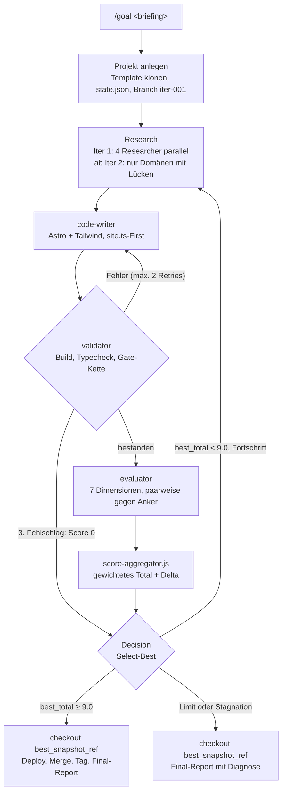

# agent-harness

Multi-Agent-Harness für [Claude Code](https://docs.claude.com/en/docs/claude-code), der statische
Websites (Astro + Tailwind, Deploy auf Cloudflare Pages) in einem geschlossenen Qualitäts-Loop
baut: Research, Code, Validierung, Bewertung, Entscheidung. Der Loop läuft, bis ein gewichteter
Score von **9.0 / 10** erreicht ist oder ein hartes Abbruchkriterium greift. Ausgeliefert wird
immer der bestbewertete Stand, nicht der letzte.

```bash
/goal "Sauerteig-Bäckerei mit Café, modernes minimalistisches Design, Vorbestellung per Telefon"
```

## Inhalt

- [Architektur](#architektur)
- [Bewertung und Entscheidung](#bewertung-und-entscheidung)
- [Deterministische Schichten](#deterministische-schichten)
- [Zweiter Modus: Freigabe-Gates](#zweiter-modus-freigabe-gates)
- [Voraussetzungen](#voraussetzungen)
- [Installation und Aufruf](#installation-und-aufruf)
- [Tests](#tests)
- [Beispiellauf](#beispiellauf)
- [Grenzen](#grenzen)

## Architektur



Jede Rolle ist ein eigener Sub-Agent in `.claude/agents/` mit fester Modell-Zuordnung:

| Agent | Modell | Aufgabe |
|---|---|---|
| `orchestrator` | opus | Koordiniert den Loop, verwaltet Git-Iterationen und `state.json`, trifft die Decision |
| `researcher-design` | sonnet | Design- und UI-Pattern-Recherche zum Briefing |
| `researcher-industry` | sonnet | Branchen- und Content-Recherche, Textentwürfe |
| `researcher-legal-dsgvo` | sonnet | Impressums- und Datenschutzpflichten |
| `researcher-tech-stack` | sonnet | API-Recherche zu Astro, Tailwind, Cloudflare Pages |
| `design-system-architect` | opus | Mehrere eigenständige Design-Optionen mit Style-Tile (nur `/freigabe`) |
| `code-writer` | opus | Implementierung, alle Texte zentral in `src/content/site.ts` |
| `validator` | sonnet | Build, `tsc --noEmit`, Routen, deterministische Gates |
| `evaluator` | opus | Bewertung in 7 Dimensionen, Gap-Liste für die nächste Iteration |

Jedes Zielprojekt ist ein eigenes Git-Repository unter `~/projects/<name>/` mit einem Branch pro
Iteration (`iter-001`, `iter-002`, ...) sowie `research/`, `validation/`, `evals/`, `scores/` und
`FINAL-REPORT.md`. Der Harness selbst bleibt unverändert. Details in [`ARCHITECTURE.md`](./ARCHITECTURE.md).

## Bewertung und Entscheidung

**Score-Formel** (`scripts/score-aggregator.js`, Gewichtssumme wird auf 1.0 geprüft):

| Dimension | Gewicht | Grundlage |
|---|---|---|
| Visual Quality | 0.20 | Screenshots 1440 px und 390 px, paarweise gegen eingefrorene Anker |
| Conversion | 0.20 | CTA above the fold, Tap-Targets ≥ 44 px, Trust-Signale |
| Performance | 0.15 | Lighthouse: LCP, CLS, INP |
| SEO | 0.15 | Title/Meta, JSON-LD, Sitemap, Canonical |
| Accessibility | 0.10 | axe-core-Violations aus dem Gate |
| DSGVO | 0.10 | Impressum, Datenschutzerklärung, keine externen Tracker oder Fonts ohne Consent |
| Code-Quality | 0.10 | Typecheck, kein `any`, Komponenten < 150 Zeilen, site.ts-First |

`total = Σ(score × gewicht)`, Schwelle zum Deploy: 9.0.

**Kalibrierter Visual-Judge.** Die Visual-Dimension wird nicht absolut benotet. Der evaluator
vergleicht den Build paarweise mit eingefrorenen Referenz-Screenshots bekannter Note und
interpoliert zwischen dem höchsten geschlagenen und dem niedrigsten ungeschlagenen Anker, mit
Konsistenzregel ([`anchors/ANCHORS.md`](./anchors/ANCHORS.md)). Zusätzlich deckelt ein
Distinctiveness-Malus generische Baukasten-Designs bei 6.0 (`.claude/skills/design-system/`).
Damit ist 9.0 ohne eigenständige Gestaltung nicht erreichbar.

**Select-Best statt Last-Wins.** `state.json` führt `best_total` und `best_snapshot_ref`. Ein Stand
gilt nur als neuer Bestwert, wenn `total > best_total`. Ohne Verbesserung folgen bis zu drei
Resamples auf denselben Gaps. Ausgeliefert wird per `git checkout best_snapshot_ref`, weil
Politur-Iterationen regelmäßig bereits gute Bereiche verschlechtern.

**Hard-Limits** gegen Endlos-Loops:

| Limit | Wert |
|---|---|
| Iterationen pro Projekt | 15 |
| Gesamtlaufzeit | 90 Minuten |
| Konvergenz-Stopp | Δ < 0.3 über 2 Iterationen |
| Validator-Retries pro Iteration | 2, danach Score 0 |
| Tool-Call-Retries | 3, Backoff 1 s / 3 s / 10 s |

## Deterministische Schichten

**Gate-Kette ohne Token-Kosten.** Vor jeder LLM-Bewertung prüft der validator den Build mit
festen Werkzeugen und schreibt die Ergebnisse als JSON nach `validation/gates/`. Der evaluator
übernimmt sie als Fakten, statt sie selbst zu schätzen.

| Gate | Prüft | Wirkung |
|---|---|---|
| vnu | HTML-Konformität | 0 Fehler Pflicht |
| lychee | interne Links und Anker (offline) | 0 defekte Pflicht |
| axe (`scripts/gates/axe-gate.mjs`) | WCAG-Violations über lokalen Server | 0 Violations Pflicht |
| impeccable detect | Anti-Pattern-Detektor für generisches Design | weich, Count fließt in den Score |
| `check-sitets-first.sh` | hartkodierte Texte in `src/pages/**/*.astro` | Pflicht |

Fehlt ein optionales Werkzeug, wird das Gate als `skipped` markiert und nicht als Fehler gewertet.

**Hooks** (`scripts/hooks/`, registriert in `.claude/settings.json`) laufen unabhängig vom Modell:

| Hook | Event | Zweck |
|---|---|---|
| `pre-bash-guard.sh` | PreToolUse | Blockt `rm -rf` auf System- und Home-Pfade, Force-Push auf `main`/`master`, `curl \| sh`, Fork-Bombs, globale Installs sowie `Remove-Item -Recurse -Force`, wenn PowerShell über die Bash aufgerufen wird. Erkennt auch Umgehungen über `eval`, `bash -c` und Command-Substitution. |
| `post-edit-format.sh` | PostToolUse | Formatiert geänderte Dateien mit dem projektlokalen Prettier |
| `stop-trajectory.sh` | Stop | Sichert das Session-Transcript für Debugging und spätere Auswertung |

Exit-Semantik: `0` lässt den Aufruf durch, `2` blockt und gibt den Grund an das Modell zurück.
Exit `1` wird bewusst nie verwendet, weil er nicht blockiert.

**Warum `bypassPermissions`.** Der Loop soll ohne Rückfragen laufen. Vertretbar ist das nur in
Kombination: eigenes Arbeitsverzeichnis pro Projekt, Git-Branch pro Iteration (Rollback jederzeit),
keine Production-Secrets im Harness und die Hooks als harte Schranke. Wer das nicht möchte, stellt
in `.claude/settings.json` auf `acceptEdits` um und pflegt eine Bash-Allowlist.

## Zweiter Modus: Freigabe-Gates

Für Projekte, bei denen ein Mensch mitentscheidet, ergänzt der Freigabe-Modus den autonomen Loop
um drei menschliche Freigabe-Gates, eine Anforderungserhebung per Web-Fragebogen und ein
projektspezifisches Design-System ([`FREIGABE-MODUS.md`](./FREIGABE-MODUS.md)):

1. `/freigabe "<Worum geht es>"` erzeugt einen projektspezifischen Fragebogen als eigenständiges
   HTML-Formular (`scripts/make-intake.mjs`, zentraler Renderer in `templates/intake/`). Das
   Formular speichert Zwischenstände lokal, zeigt den Fortschritt und bietet nach dem Absenden eine
   Sicherungskopie der Antworten als Datei an.
2. `/freigabe-briefing` verdichtet die Antworten zu `briefing.json` und prüft auf Widersprüche.
   **Gate 1:** Briefing-Freigabe.
3. `/freigabe-go` startet die Researcher und den `design-system-architect`, der mehrere
   Design-Optionen als Style-Tiles vorlegt. **Gate 2:** Auswahl einer Option.
4. Erneutes `/freigabe-go` fährt den Loop bis Score ≥ 9.0. **Gate 3:** Deploy-Freigabe
   (`--deploy manual` als Standard).

## Voraussetzungen

| Werkzeug | Zweck | Pflicht |
|---|---|---|
| Claude Code | Laufzeit für Agents, Skills und Hooks | ja |
| Node.js ≥ 20 und npm | Skripte, Tests, Astro-Build | ja |
| Git und Bash (unter Windows Git Bash) | Iterations-Branches, Hooks, Shell-Skripte | ja |
| wrangler mit Cloudflare-Login | Deploy auf Cloudflare Pages | für Deploy |
| [vnu](https://validator.github.io/validator/) (`vnu` im `PATH` oder `VNU=<pfad>`) | HTML-Gate | optional |
| [lychee](https://lychee.cli.rs/) | Link-Gate | optional |
| [impeccable](https://www.npmjs.com/package/impeccable) | Anti-Pattern-Gate (`npx impeccable detect`) | optional |
| [playwright-cli](https://github.com/microsoft/playwright-cli) | token-sparsame Browser-Steuerung für den evaluator | optional |
| MCP-Server `chrome-devtools`, `playwright`, `context7` | Lighthouse, Screenshots, Doku-Recherche | empfohlen |
| Skill `styleseed-design-review` | unabhängige Zweitmeinung zum Visual-Score | optional |

Unter Windows vor `curl`/`wrangler`-Aufrufen mit Pfaden `export MSYS_NO_PATHCONV=1` setzen.

## Installation und Aufruf

```bash
git clone <repo-url> ~/agent-harness
cd ~/agent-harness
npm install
cp config/intake.example.json config/intake.json   # nur für /freigabe, Werte eintragen
claude
```

Der Harness erwartet sich selbst standardmäßig unter `~/agent-harness` und legt Zielprojekte unter
`~/projects/` an. Beides lässt sich über die Umgebungsvariablen `HARNESS_DIR` und `PROJECTS_DIR`
ändern. Damit die Agents und Skills auch in Sessions außerhalb des Harness-Verzeichnisses verfügbar
sind, spiegelt `bash scripts/sync-global.sh` sie nach `~/.claude/` (ohne `settings.json`).

| Befehl | Wirkung |
|---|---|
| `/goal "<briefing>"` oder `/goal <datei.md>` | End-to-End: Projekt anlegen, Loop, Deploy, Report |
| `/new-project "<briefing>"` | Nur Projekt anlegen |
| `/iterate` | Genau eine Loop-Runde im aktuellen Projekt |
| `/run-loop` | Autonomer Loop bis Schwelle oder Stopp |
| `/status` | Score-Verlauf und Iterations-Historie |
| `/deploy-pages` | Aktuellen `dist/`-Build auf Cloudflare Pages deployen |
| `/freigabe`, `/freigabe-briefing`, `/freigabe-go` | Halbautonomer Freigabe-Modus mit drei Gates |

Ein fiktives Beispiel-Briefing liegt in [`examples/briefing.example.md`](./examples/briefing.example.md).

## Tests

```bash
npm test                     # Unit-Tests (node:test) + Hook-Suite
npm run test:intake-renderer # Formular-Renderer im echten Browser (Playwright, Formspree gemockt)
```

| Suite | Umfang |
|---|---|
| `scripts/test-hooks.sh` | 57 Fälle für alle drei Hooks, inklusive Umgehungsversuche und PowerShell-Varianten |
| `scripts/test-make-intake.mjs` | Konfiguration des Formulars: Tracking-Hinweis, Kontaktadresse, Escaping |
| `scripts/test-score-aggregator.mjs` | Gewichtung, Delta, Abbruch bei fehlender Dimension oder falscher Gewichtssumme |
| `scripts/test-intake-renderer.mjs` | 34 Browser-Checks: Rendering, Autosave, Validierung, Absenden, Sicherungskopie |

Der Renderer-Test deckt einen real aufgetretenen Fehlerfall ab: Formspree kann Einsendungen mit
Geldbeträgen als Spam einstufen, dennoch `ok` melden und keine Mail zustellen. Das Formular sendet
deshalb nach jeder Einsendung eine zweite, inhaltsfreie Benachrichtigung mit Zeitstempel und bewahrt
die Antworten als lokal gespeicherten Entwurf auf.

## Beispiellauf

Selbsttest mit dem Briefing einer fiktiven Sauerteigbäckerei:

```
Iter 001: total=8.80          | top gap: [high] accessibility: Grautext-Kontrast < 4.5:1
Iter 002: total=9.31 (Δ+0.51) | a11y 0 Violations, FAQPage-Schema, LCP 340 ms → SHIPPED

SHIPPED · 9.31/10 · 2 Iterationen · ca. 21 min
```

Dimensionen final: Visual 8.7 · Conversion 9.0 · Performance 9.9 · SEO 9.5 · Accessibility 9.7 ·
DSGVO 9.5 · Code-Quality 9.4. Ergebnis: 6 Seiten, kein clientseitiges JavaScript-Bundle,
selbst gehostete Fonts, JSON-LD (Bakery und FAQPage). Ein Screenshot dieses Builds dient heute
als 8.0-Anker des Visual-Judge.

## Grenzen

- Nur statische Sites, Deploy-Ziel ausschließlich Cloudflare Pages.
- Das Basis-Template pinnt Astro 6.3.6 und `@tailwindcss/vite` 4.3.0 exakt, weil neuere
  Astro-Patches die Tailwind-Integration brechen.
- Das Basis-Template erfüllt die eigene site.ts-First-Regel noch nicht vollständig: Rechtsseiten,
  404 und einige Überschriften enthalten hartkodierte Texte, die `check-sitets-first.sh` meldet.
- Hooks greifen nur, wenn die Settings geladen sind: Start aus dem Harness-Verzeichnis oder aus
  einem mit `init-project.sh` angelegten Projekt.
- Der Bash-Guard ist nur für das Bash-Tool registriert. Befehle über ein eigenes PowerShell-Tool
  prüft er nicht.
- Der Bash-Guard prüft den Befehlstext statisch. Variablen-Expansion zur Laufzeit wird nicht
  aufgelöst.
- Die Visual-Dimension bleibt ein Modellurteil. Die Anker kalibrieren es, ersetzen aber keine
  menschliche Abnahme. Dieses Repository enthält einen der vorgesehenen 3 bis 5 Anker, weitere
  werden aus eigenen Läufen ergänzt.
- Sub-Agents können in Claude Code keine weiteren Sub-Agents starten. `/freigabe-go` läuft deshalb
  im Hauptkontext, der die Orchestrator-Rolle übernimmt.

## Lizenz

[MIT](./LICENSE)
